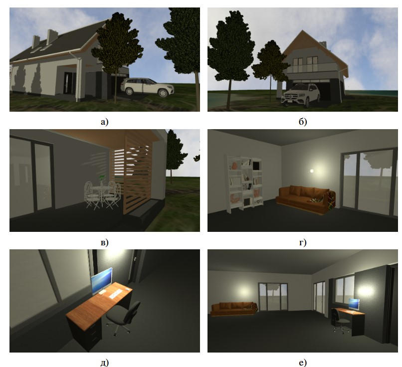
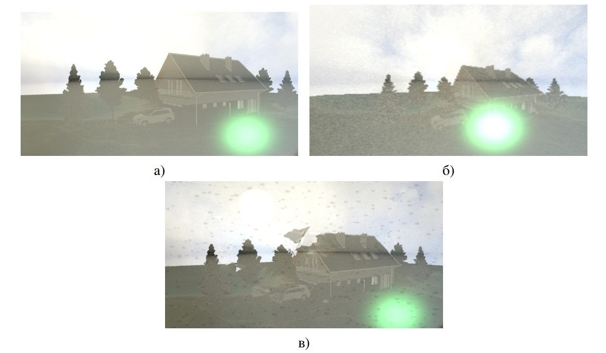
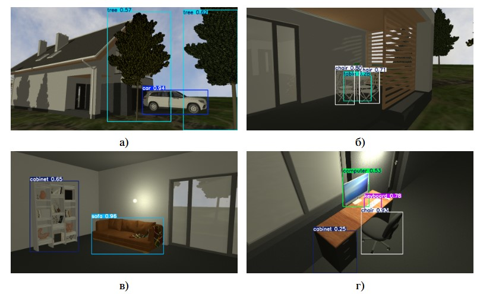
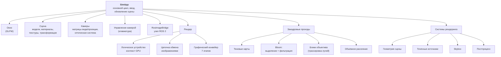

<div align="center">

# Симулятор для тестирования алгоритмов компьютерного зрения**

Генератор фотореалистичных синтетических изображений на **Vulkan** и **C++** с интеграцией в **ROS 2**.
Физически корректное моделирование камеры, освещения, теней и оптических искажений
для проверки устойчивости алгоритмов машинного зрения в управляемых условиях.

[](https://isocpp.org/)
[](https://www.vulkan.org/)
[](https://docs.ros.org/en/jazzy/)
[](https://releases.ubuntu.com/noble/)
[](https://cmake.org/)



<sub>Выпускная квалификационная работа · МГТУ им. Н.Э. Баумана · факультет «Робототехника и комплексная автоматизация» · кафедра РК-6 «Системы автоматизированного проектирования» · 2026</sub>

</div>

---

## Содержание

- [О проекте](#о-проекте)
- [Возможности](#возможности)
- [Примеры работы](#примеры-работы)
- [Архитектура](#архитектура)
- [Технологический стек](#технологический-стек)
- [Установка](#установка)
- [Сборка и запуск](#сборка-и-запуск)
- [Конфигурация сцены](#конфигурация-сцены)
- [Автор](#автор)

---

## О проекте

Эффективность алгоритмов компьютерного зрения (СКЗ) напрямую зависит от объёма и разнообразия тестовых данных. Сбор реальных изображений ограничен: данных мало, ручная разметка трудоёмка и подвержена ошибкам, а редкие или опасные сценарии воспроизвести на реальной технике почти невозможно. Синтетические данные снимают эти ограничения — положение, классы и геометрия объектов известны уже на этапе моделирования, что исключает погрешности аннотирования и позволяет генерировать неограниченный поток размеченных кадров.

Готовые решения — игровые движки (Unreal Engine, Unity) и робототехнические симуляторы (Gazebo, NVIDIA Isaac Sim) — либо не интегрированы со средствами робототехники и требовательны к ресурсам, либо жертвуют качеством визуализации ради физической достоверности. `cv_simulator` закрывает этот разрыв: собственный конвейер рендеринга на низкоуровневом Vulkan API даёт полный контроль над этапами формирования изображения и эффективное использование GPU, а нативная интеграция с ROS 2 обеспечивает совместимость с существующими инструментами машинного зрения без их модификации.

Ключевая идея — **воспроизводить факторы, критически влияющие на работу СКЗ**: оптические искажения, блики, засветку, загрязнение объектива, изменение разрешения и рассеяние света. Это повышает репрезентативность синтетических выборок и позволяет в управляемых условиях оценивать устойчивость алгоритмов при переносе на реальные сцены.

---

## Возможности

**Сцена и геометрия**
- Описание сцены декларативным конфигурационным файлом в формате JSON.
- Загрузка произвольных 3D-моделей формата OBJ (через `tinyobjloader`) с позицией, поворотом и масштабом.
- Формирование неба кубической текстурой (skybox cubemap).
- Фрустум-отсечение сферическими ограничивающими объёмами со сложностью O(N).

**Освещение и тени**
- Локальная модель освещения Блинна–Фонга: фоновая, диффузная (закон Ламберта) и зеркальная составляющие.
- Точечные источники света с затуханием по расстоянию и направленный солнечный свет.
- Динамические тени методом теневых карт (теневой буфер 4096×4096, смещение против shadow acne).

**Оптические искажения** — моделируются физически, трассировкой лучей, а не параметрической аппроксимацией:
- **Блики (lens flare / ghosts)** — обратная трассировка лучей через многолинзовый объектив и прямая трассировка переотражений между поверхностями линз; каждый блик определяется парой отражающих поверхностей, яркость распределяется по двумерной функции Гаусса.
- **Засветка (bloom)** — двухпроходная разделимая гауссова фильтрация выделенных ярких областей.
- **Объёмное рассеяние света** — отдельный проход трассировки.
- **Загрязнение оптики** — пыль (`dustDensity`) и капли воды (`waterDroplets`) с преломлением и искажением изображения.
- Преломление и отражение на границах сред по закону Снеллиуса, полное внутреннее отражение, коэффициент Френеля в приближении Шлика.

**Виртуальная камера**
- Матрицы преобразования вида и проекции (перспективная / ортографическая).
- Настраиваемая оптическая система: последовательность сферических линз с радиусом кривизны, показателем преломления, апертурой и флагом диафрагмы.
- Произвольное число камер, каждая публикует кадры в собственный ROS-топик и работает независимо.

**Интеграция с ROS 2**
- Публикация синтетических кадров в топик `/sim/<camera>/image` в формате `sensor_msgs/Image`.
- Приём управляющих команд из `/sim/<camera>/cmd` в формате `geometry_msgs/Twist`.
- Управление активной камерой с клавиатуры или по командам ROS.
- Кадр остаётся в памяти GPU до момента публикации или сохранения — без лишних копий в оперативную память.

---

## Примеры работы

### Сформированный датасет

Сцена из 35 объектов с точечными источниками света, прозрачными материалами, а также простыми и высокополигональными моделями (деревья, автомобиль, дом, мебель). Три камеры с разрешениями 1920×1080, 200×200 и 1280×720 публикуют кадры в независимые ROS-каналы.

<div align="center">

</div>

### Моделирование оптических дефектов

Один и тот же кадр без дефектов, при пониженном разрешении и с загрязнением объектива. Изображение за каплями воды преломлено; кадр с пылью заметно темнее из-за рассеяния света на частицах.

<div align="center">

</div>

### Детектирование объектов (YOLO-World)

Проверка пригодности синтетических кадров для СКЗ. Модель YOLO-World уверенно распознаёт автомобиль (0.94), диван (0.96), мебель и технику; объекты со слабо выраженными геометрическими признаками или частичным перекрытием детектируются с меньшей уверенностью.

<div align="center">

</div>

### Чувствительность к искажениям

На чистом кадре с бликом и засветкой автомобиль по-прежнему детектируется (0.94). При добавлении дефектов объектива — размытия за каплями, снижения контраста от пыли, падения разрешения — число детекций резко падает вплоть до полного их отсутствия. Это подтверждает, что моделируемые искажения влияют на СКЗ сопоставимо с реальными помехами.

<div align="center">

</div>

### Стресс-тест

Отображение 100 000 моделей и 100 000 точечных источников света (200 000 объектов). Средняя частота — 1 кадр/с; тест выявляет необходимость оптимизаций сцены и снижения числа вызовов отрисовки для работы с большим числом объектов.

---

## Архитектура

Симулятор построен по паттерну **модульного монолита с конвейером рендеринга**. Выбор обоснован ключевыми требованиями: высокая производительность, предсказуемое время формирования кадра, строгий контроль жизненного цикла GPU-ресурсов и минимизация обмена данными между CPU и GPU. Единое адресное пространство и общий контекст Vulkan обеспечивают эти свойства, а конвейерная модель структурирует визуализацию как последовательность этапов, каждый из которых опирается на результаты предыдущих.



Разбиение на изолированные подсистемы с чёткими границами ответственности упрощает расширение системы при дальнейшей разработке.

---

## Технологический стек

| Компонент | Назначение |
|-----------|-----------|
| **C++11** | Язык реализации |
| **Vulkan API** | Низкоуровневый рендеринг, явное управление ресурсами и памятью GPU |
| **SPIR-V** | Промежуточный язык графических и вычислительных шейдеров |
| **ROS 2 (Jazzy)** | Публикация кадров и приём команд управления камерой |
| **GLFW** | Создание окна, обработка ввода, связь с графической подсистемой ОС |
| **GLM** | Линейная алгебра (векторы, матрицы, кватернионы) |
| **nlohmann/json** | Разбор конфигурационного файла сцены |
| **tinyobjloader** | Загрузка 3D-моделей формата OBJ |
| **CMake + colcon** | Кроссплатформенная сборка и компиляция шейдеров |

---

## Установка

Целевая платформа — **Ubuntu 24.04 Noble**.

### 1. ROS 2 Jazzy

Установить ROS 2 Jazzy по [официальной инструкции](https://docs.ros.org/en/jazzy/Installation/Ubuntu-Install-Debs.html), затем добавить `colcon` и инструменты сборки:

```bash
sudo apt install -y python3-colcon-common-extensions python3-rosdep2
```

### 2. Vulkan

```bash
# Драйвер (если ещё не установлен)
sudo apt install -y mesa-vulkan-drivers

# Инструменты диагностики; после установки запустите vkcube,
# чтобы убедиться, что устройство поддерживает Vulkan
sudo apt install -y vulkan-tools

# Vulkan loader для линковки с Vulkan API
sudo apt install -y libvulkan-dev

# Компиляция и валидация шейдеров
sudo apt install -y glslang-tools

# Отладочные слои валидации
sudo apt install -y vulkan-validationlayers
```

> Если `vkcube` выводит ошибки — обновите драйверы и проверьте, что графическая карта поддерживается.

### 3. Инструменты SPIR-V

```bash
sudo apt install -y spirv-tools
```

### 4. Прочие библиотеки

```bash
sudo apt install -y libglfw3-dev      # окна, ввод, графическая подсистема ОС
sudo apt install -y libglm-dev        # линейная алгебра
sudo apt install -y nlohmann-json3-dev # JSON for Modern C++
```

---

## Сборка и запуск

Подключить окружение ROS 2:

```bash
source /opt/ros/jazzy/setup.bash
```

Собрать проект из корневой директории рабочего пространства:

```bash
colcon build --packages-select cv_simulator --symlink-install
```

Активировать рабочее пространство:

```bash
source install/setup.bash
```

Запуск без аргументов отображает сцену `scene_config.json` из папки `assets` по умолчанию:

```bash
ros2 run cv_simulator cv_simulator
```

### Аргументы командной строки

| Аргумент | Описание |
|----------|----------|
| `--scene <путь>` | Путь к JSON-файлу сцены |
| `--stress` | Запуск стресс-теста |
| `--stress-count <число>` | Стресс-тест с заданным числом объектов на сцене |
| `--stress-spacing <число>` | Расстояние между объектами в стресс-тесте |
| `--stress-model <путь>` | Модель для отображения в стресс-тесте |

### Примеры

Стресс-тест с заданными параметрами:

```bash
ros2 run cv_simulator cv_simulator --stress --stress-count 200 \
  --stress-spacing 1.2 \
  --stress-model src/cv_simulator/assets/models/smooth_vase.obj
```

Запуск с передачей пути к конфигурационному файлу:

```bash
ros2 run cv_simulator cv_simulator --scene src/cv_simulator/assets/simple_scene.json
```

---

## Конфигурация сцены

Сцена задаётся файлом JSON. Ниже — обзор доступных секций и параметров.

**Модели** (`models`) — список объектов с путём к OBJ-файлу, положением в мировых координатах (`position`), поворотом в радианах (`rotation`) и масштабом (`scale`).

**Солнце** (`sun`) — направление (`direction`), яркость (`intensity`) и цвет (`color`) направленного источника.

**Точечные источники** (`pointLights`) — цвет, яркость, радиус и позиция каждого источника в мировых координатах.

**Камеры** (`cameras`) — произвольное число камер, у каждой можно задать:

| Параметр | Описание |
|----------|----------|
| `name` | Имя камеры (используется в имени ROS-топика) |
| `control` | Управление: `keyboard` или `ros` |
| `position`, `rotation` | Положение (мировые координаты) и поворот (радианы) |
| `resolution` | Разрешение генерируемых кадров |
| `fov` | Угол обзора |
| `near`, `far` | Ближняя и дальняя плоскости отсечения |
| `width`, `height`, `z` | Ширина, высота и длина сенсора, регистрирующего поток фотонов |

**Линзы камеры** — последовательность сферических поверхностей оптической системы:

| Параметр | Описание |
|----------|----------|
| `radius` | Радиус кривизны поверхности |
| `z` | Положение поверхности на оптической оси |
| `ior` | Показатель преломления за поверхностью |
| `aperture` | Радиус апертуры |
| `isStop` | Флаг диафрагмы: `true` — ограничивает пучок без преломления; `false` — обычная преломляющая линза (закон Снеллиуса) |

**Дефекты отображения**:

| Параметр | Диапазон | Описание |
|----------|----------|----------|
| `dustDensity` | 0–1 | Плотность пылевых частиц на поверхности линз |
| `waterDroplets` | 0–1 | Количество и размер капель воды на объективе |

---

## Автор

**Хакимова Д.Ф.**, группа РК6-85Б
Руководитель ВКР — **Козов А.В.**

<div align="center">
<sub>МГТУ им. Н.Э. Баумана · кафедра РК-6 «Системы автоматизированного проектирования» · 2026</sub>
</div>
